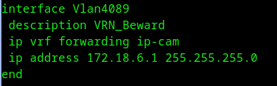
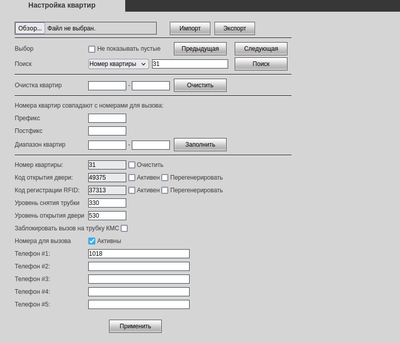

# Инструкция_Just-Home

  * **Содержание**
  * Justhome Что в себя включает?
  * Регистрация клиентов
    *       * Учётка
      * Посмотреть счёт
      * Диагностика
  * Схема just_home
  * Раздел Домофоны
    *       * Панель BEWARD
      * JustHome Создание домов
      * Видеопоток для домофона или просто для камер
  * Раздел счётчики.
  * Раздел Шлагбаум.
  * Раздел Видеонаблюдение.
    *       * troubleshooting

## **Justhome Что в себя включает?**¶

Justhome - как услуга для умного дома , включает в себя несколько сервисов.

    
    
    Домофон
    Счётчики
    Шлагбаум
    Видеонаблюдение
    

Все это организованно и реализованно в разных местах, но в конечном итоге
сливается на адрес умного дома,начнём с авторизации клиентов в justhome

## Регистрация клиентов¶

Регистрация клиентов происходит по звонку , где клиент вводит последние 4
цифры из номера телефона .  
Реализовано это через партнёров <https://office.sms-agent.ru>  
Пополняем туда денежку (на лицевой счёт) , все звонки идут со стороннего
сервера клиенту на телефон , клиент вводит последние 4 цифры номера телефона.
Всё.

Чуть ниже описано как что посмотреть .

SMPP smpp3.sms-agent.ru:2775  
IP 158.160.14.51

#### Учётка¶

Показать  Скрыть

  
bakalinsv Логин  
Kvant@2023 Пароль

#### Посмотреть счёт¶

Показать  Скрыть

  
Посмотреть счёт  

#### Диагностика¶

Показать  Скрыть

  
Диагностика  

## Схема just_home¶

**Схему можно посмотреть по[*ССЫЛКЕ](https://drive.google.com/file/d/1DQZ-
_c4hVdiNNM2iRnjNrdQYs_1YTkRe/view?usp=sharing)**

## Раздел Домофоны¶

> Пока на сегодняшний день ставятся панели Beward. Сетку под них оставили ту-
> же самую что и было в vlane 4089 172.18.6.0/24. Всё это реализованно , на
> cisco ip-cam , сетка заведена в vrf ip-cam.

Соответственно , всё это дело бросается до конечного клиента , панели даётся
ip адресс из сетки что и упоминали ранее "172.18.6.0/24" p.s смотрим по arp
"C3402_IP_CAM#show ip arp vrf ip-cam | i 172.18.6" .  
 **Панели в обязательном парядке в BUGS заводятся, с его IP** .

После того как бросили влан на коммутатор, ребята подключили панель . Заходим
на панель и далее действуем по инструкции.

#### Панель BEWARD¶

Показать  Скрыть

  
**Шаг 1 - Открываем вкладку SIP. Далее раздел " Настройка SIP #1 " Ставим
галочку "Разрешить SIP #1"  
Далее нам нужна учётка SIP .  
Имя: 1002  
Номер: 1002  
Имя пользователя: 1002  
Пароль: kvantsyper  
sip port 5365  
Разрешаем регистрацию.**

Делаем всё как по образу только учётку sip меняем! SIP сервер будет
91.202.24.59

**Далее раздел квартииры . Держим в голове что к каждой учётке SIP есть ещё
одна , если можно так выразится подучётка.**

Например к учётке SIP 1002 с паролем kvantsyper

Есть номера телефонов с паролем под каждую квартиру 1001 кв 1 1002 кв 2 1003
кв 3 и т.д  
Добавляем номера в раздел квартиры пока это всё вручную

